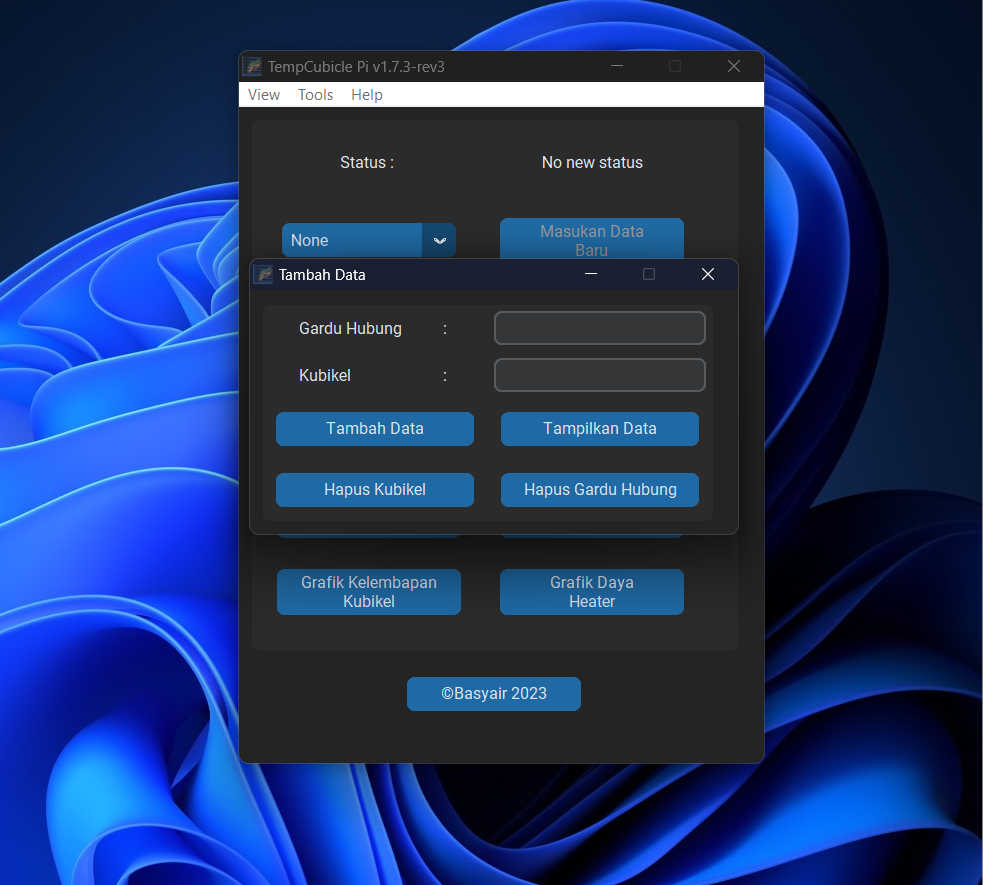
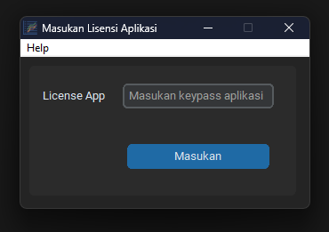

# TempCubiclePi
Project Program Magang MBKM Kampus Merdeka 2022

## Pembaruan Aplikasi
- Mengubah tema aplikasi
- Menambahkan pengaman lisensi aplikasi (Mengindari modifikasi aplikasi dari orang tidak bertanggung jawab)

## Tujuan aplikasi
Tujuan aplikasi ini untuk memantau suhu dan kelembapan pada kubikel 20kv dengan sistem Internet of Things

# Features Aplikasi TempCubiclePi

## Feature utama
- Menambah Nama Gardu Hubung

- Memasukan Data Baru Gardu Hubung
- Ambil Data
- Setop Ambil Data
- Tampilkan data sensor per kubikel
- Hapus data per kubikel (Hapus Kubikel)
- Hapus semua data kubikel (Hapus Gardu Hubung)
- Grafik suhu kubikel
- Grafik kelembapan kubikel
- Grafik daya kubikel

## Feature tambahan

- Unduh rekaman Kubikel 
- Buka folder rekaman

# Spesifikasi Aplikasi TempCubicle Pi
- Windows 7, 8.1, 10, 11 dengan operasi 64 bit (x86_64)
- Ram 4gb atau lebih baik
- Hardisk 200mb atau lebih baik

# Lisensi Aplikasi
Aplikasi ini memiliki lisensi BSD 3-Clause License, dengan catatan
1. Harus memiliki kode keypass aplikasi untuk menjalankan program

2. Memiliki izin dari developer untuk memodifikasi aplikasi
3. Developer TempCubiclePi tidak bertanggung jawab jika pengguna meng-unduh aplikasi selain dari https://github.com/basyair7/TempCubiclePi (aplikasi bajakan)

## Error 0-1

Jika muncul error seperti ini, pengguna harus memiliki file serviceAccount.json dan index.json. 
File tersebut bisa dapat menghubungi developer <a href="https://t.me/ahul7" target="_blank">Telegram</a>

# Powered By

    <a href="https://customtkinter.tomschimansky.com/" target="_blank">
        <picture>
            <source media="(prefers-color-scheme: dark)" srcset="https://raw.githubusercontent.com/TomSchimansky/CustomTkinter/master/documentation_images/CustomTkinter_logo_dark.png">
            
        </picture>
    </a>

<h3 align="center"><a href="https://customtkinter.tomschimansky.com/" target="_blank">Custom Tkinter</a></h3>

    

<h3 align="center"><a href="https://firebase.google.com/" target="_blank">Firebase Database</a></h3>

